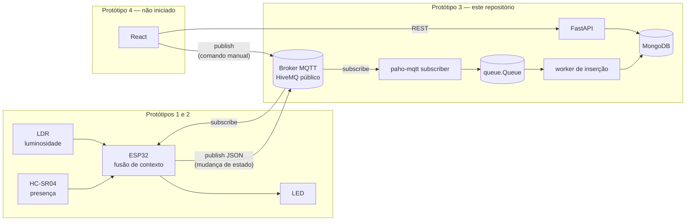
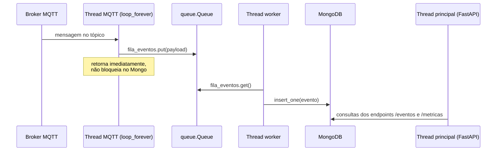

# Arquitetura

Este documento descreve a arquitetura do projeto em duas camadas: primeiro a **visão geral do
sistema completo** (os quatro protótipos propostos em [`1_PLANEJAMENTO.pdf`](./1_PLANEJAMENTO.pdf)),
depois o **detalhamento da API** (o backend em Python, que implementa o Protótipo 3 e é o que
existe hoje neste repositório).

Os relatórios de execução dos Protótipos 1 e 2 (montagem física, código MicroPython, testes com
o broker público) estão em [`2_RELATÓRIO_PROTO2.pdf`](./2_RELATÓRIO_PROTO2.pdf).

## Índice

1. [Visão geral do sistema](#1-visão-geral-do-sistema)
2. [Arquitetura da API](#2-arquitetura-da-api)
3. [Limitações conhecidas e próximos passos](#3-limitações-conhecidas-e-próximos-passos)

## 1. Visão geral do sistema

### 1.1. Motivação e objetivo

O sistema detecta presença e luminosidade ambiente para controlar uma carga de iluminação de
forma autônoma, evitando desperdício de energia com luzes acesas em ambientes vazios ou já
iluminados naturalmente. A arquitetura é distribuída em quatro protótipos incrementais, cada um
funcional de forma independente:

| Protótipo | Escopo | Status |
|---|---|---|
| 1 - Detecção e controle local | ESP32 + HC-SR04 + LDR, fusão de contexto, aciona o LED localmente | ✅ implementado |
| 2 - Conectividade e publicação MQTT | ESP32 publica eventos de transição de estado (JSON) num broker público (HiveMQ) | ✅ implementado |
| 3 - Gateway computacional e persistência | Backend Python assina o tópico MQTT, persiste eventos e calcula eficiência energética | ✅ implementado (**este repositório**) |
| 4 - Interface e atuação remota bidirecional | Frontend React consome a API e publica comandos de controle manual num tópico MQTT | ⏳ não iniciado |

### 1.2. Diagrama de blocos



A seta de `Broker` para `ESP` no bloco do Frontend só existe a partir do Protótipo 4: é o canal de
controle remoto, quando o ESP32 passa a assinar também um tópico de comando (além de publicar
no tópico de eventos).

### 1.3. Papel de cada componente

- **ESP32 (Protótipos 1 e 2):** lê os sensores, decide o estado do LED e publica um evento sempre
  que esse estado muda (não faz polling contínuo — só transições).
- **Broker MQTT:** desacopla publishers e subscribers. Hoje é o broker público `broker.hivemq.com`;
  nada na arquitetura impede trocar por um broker privado (só requer credenciais e TLS, já
  suportado em `mqtt_client.py`).
- **Backend / API (Protótipo 3):** um único processo Python com três responsabilidades — assinar o
  tópico MQTT, persistir os eventos brutos e as métricas agregadas, e expor tudo via REST. Detalhado
  na seção 2.
- **Frontend (Protótipo 4, futuro):** consumirá os endpoints REST para exibir histórico e métricas, e
  publicará no tópico de controle para sobrepor manualmente a lógica autônoma do ESP32.

## 2. Arquitetura da API

### 2.1. Stack e decisões de framework

FastAPI foi escolhido em vez de Flask por três motivos práticos, todos relevantes para este projeto
especificamente:

- validação automática de request/response com Pydantic;
- documentação Swagger gerada automaticamente em `/docs`, útil já que o Protótipo 4 vai consumir
  esses mesmos endpoints;
- suporte nativo a `async`, relevante porque o subscriber MQTT e a API rodam no mesmo processo
  (ver 2.3).

### 2.2. Estrutura de pastas

```
backend/
├── main.py           # instância do FastAPI, lifespan, registro dos routers
├── config.py         # load_dotenv e todas as constantes (Mongo, MQTT)
├── database.py       # conexão com Mongo, inicializar_banco() (índices)
├── mqtt_client.py    # subscriber paho-mqtt, fila de eventos, worker de inserção
├── services.py       # regras de negócio de cálculo (agregar_dia())
├── routers/
│   ├── eventos.py    # endpoints /eventos e /eventos/hoje
│   └── metricas.py   # endpoints /metricas e /metricas/agregar
├── .env              # não versionado — ver variáveis na seção 2.7
└── requirements.txt
```

Cada módulo importa apenas de quem está "acima" dele nessa lista (`config.py` não importa nada
interno; `database.py` só importa de `config.py`; `mqtt_client.py` e `services.py` importam de
`database.py`; os `routers/` importam de `database.py` e `services.py`; `main.py` importa de todos).
Isso evita import circular e deixa explícito onde cada responsabilidade mora.

### 2.3. Modelo de concorrência: três threads

O subscriber MQTT (`paho-mqtt`) e a API (FastAPI/uvicorn) rodam no mesmo processo. A alternativa
seria dois processos separados, mas isso duplicaria a conexão com o Mongo e exigiria um mecanismo
extra de comunicação entre eles — desnecessário aqui, já que os dois lados só precisam compartilhar
o banco de dados.



Três threads rodam simultaneamente, todas iniciadas no `lifespan` de `main.py`:

1. **Thread principal** — o processo do uvicorn/FastAPI, atende requisições HTTP.
2. **Thread do subscriber** (`iniciar_subscriber`, daemon) — roda `client.loop_forever()`, bloqueada
   esperando mensagens do broker.
3. **Thread do worker** (`worker_insercao`, daemon) — consome `fila_eventos` e insere no Mongo.

A `queue.Queue` é o único ponto de comunicação entre as threads 2 e 3, e é thread-safe por
construção do próprio módulo `queue`. Ela existe para que uma escrita lenta no Mongo nunca atrase o
recebimento de mensagens MQTT — se o worker atrasar, mensagens só se acumulam na fila em memória,
o `on_message` do paho continua respondendo rápido.

### 2.4. Fluxo de dados: do ESP32 ao MongoDB

```
paho-mqtt recebe mensagem → json.loads() → deposita na fila →
worker consome a fila → anexa timestamp (UTC) → insere no MongoDB
```

O ESP32 já publica o payload como JSON (`ujson.dumps()`, ver Protótipo 2). O backend decodifica com
`json.loads()` e o timestamp é sempre gerado no backend (`datetime.now(timezone.utc)`), nunca lido
do payload do ESP32 — o microcontrolador não tem RTC confiável sem sincronização NTP, então anexar
o timestamp no momento da recepção é a fonte de verdade correta para um log de eventos.

### 2.5. Modelo de dados e persistência (MongoDB)

Duas coleções, com políticas de retenção deliberadamente diferentes:

#### `eventos` — retenção curta (dados brutos)

```jsonc
{ "led": "on" | "off", "distancia": 12.4, "luminosidade": 812, "timestamp": ISODate }
```

Cada documento é uma transição de estado bruta. A coleção tem um **TTL index** em `timestamp`
(`expireAfterSeconds=604800`, 7 dias) — o MongoDB apaga os documentos automaticamente, sem
precisar de nenhum job de limpeza. Sete dias é suficiente para a visualização de histórico recente no
frontend e para o cálculo de métricas do período corrente; guardar o evento bruto indefinidamente
não teria uso e faria a coleção crescer sem limite.

#### `metricas` — retenção longa (dados agregados)

```jsonc
{ "data": ISODate, "total_eventos": 14, "tempo_apagado_s": 61200.0, "percentual_economia": 70.83 }
```

Um documento por dia, com índice único em `data` (permite `upsert` idempotente). Ao contrário dos
eventos brutos, esse documento é pequeno e não cresce com o volume de eventos — faz sentido
guardá-lo indefinidamente, é o dado que efetivamente importa para o relatório final (quanto tempo a
iluminação ficou desligada de forma autônoma, e o percentual de economia correspondente).

A função `agregar_dia()` em `services.py` é quem calcula e persiste esse documento: busca os
eventos do dia, mais o último evento *anterior* ao dia (para saber o estado do LED exatamente à
meia-noite), e percorre a linha do tempo somando os intervalos em que o LED esteve "off" — incluindo
o intervalo antes do primeiro evento e depois do último, não só entre eventos consecutivos.

O job de agregação depende de rodar **antes** que o TTL de 7 dias apague os eventos brutos do dia
que ele precisa agregar — hoje isso é feito manualmente via `POST /metricas/agregar` durante os
testes; em produção seria um cron job ou APScheduler chamando `agregar_dia()` todo dia à meia-noite.

### 2.6. Endpoints

| Método | Rota | Descrição |
|---|---|---|
| `GET` | `/eventos?limite=50` | Eventos brutos mais recentes, ordem decrescente. Alimenta a visualização de histórico. |
| `GET` | `/eventos/hoje` | Todos os eventos brutos do dia corrente (UTC), ordem crescente. |
| `GET` | `/metricas?limite=30` | Métricas diárias agregadas mais recentes, ordem decrescente. Alimenta o painel de eficiência energética. |
| `POST` | `/metricas/agregar` | Dispara `agregar_dia()` para o dia anterior. Durante os testes substitui o job automático de produção. |

Documentação interativa (Swagger) em `http://localhost:8000/docs` com o servidor rodando.

### 2.7. Configuração (`.env`)

| Variável | Obrigatória | Default | Descrição |
|---|---|---|---|
| `MONGO_URI` | sim | — | Connection string do MongoDB (Atlas free tier serve bem). |
| `MQTT_BROKER` | não | `broker.hivemq.com` | Host do broker MQTT. |
| `MQTT_PORTA` | não | `1883` | Porta do broker. Brokers privados com TLS tipicamente usam `8883`. |
| `MQTT_TOPICO` | não | `pervasiva/grupo1/iluminacao` | Tópico assinado pelo subscriber. |
| `MQTT_USER` / `MQTT_PASSWORD` | não | `None` | Só configuradas se o broker exigir autenticação — quando presentes, o client também habilita TLS (`tls_set()`). |

No MongoDB Atlas é preciso liberar o IP de acesso; em desenvolvimento, `0.0.0.0/0` evita travar
durante os testes (não recomendado para produção).

## 3. Limitações conhecidas e próximos passos

- **Distinção entre "off" autônomo e manual:** `percentual_economia` hoje assume que todo intervalo
  "off" é economia autônoma — válido porque, até o Protótipo 3, o LED só é controlado pela lógica de
  sensores do ESP32. A partir do Protótipo 4, com controle manual via MQTT, essa suposição deixa de
  valer e o cálculo de eficiência energética vai precisar diferenciar as duas origens (provavelmente
  adicionando um campo de origem no evento, ex. `"origem": "sensor" | "manual"`).
- **Dependência de ordem entre agregação e TTL:** se `agregar_dia()` não rodar para um dia dentro
  da janela de 7 dias do TTL, os eventos brutos daquele dia são apagados e a métrica correspondente
  nunca mais pode ser calculada retroativamente. Em produção isso precisa de um scheduler confiável
  (APScheduler ou cron), não só o endpoint manual.
- **`requirements.txt` sem versões fixadas:** funciona para desenvolvimento, mas antes da entrega
  final vale considerar fixar versões (`paho-mqtt==2.1.0`, etc.) para reprodutibilidade.
