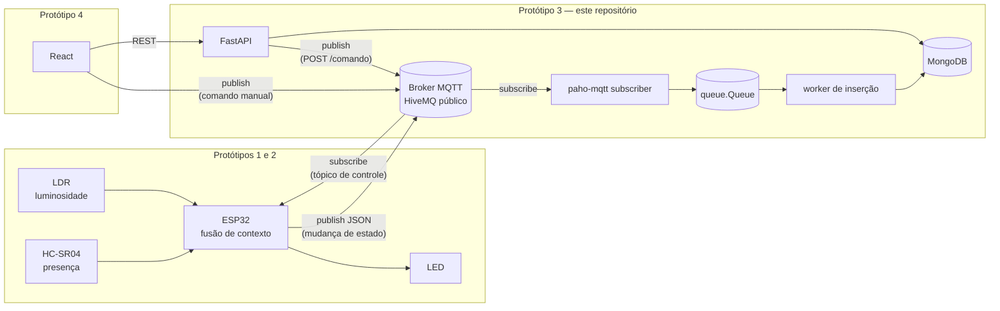
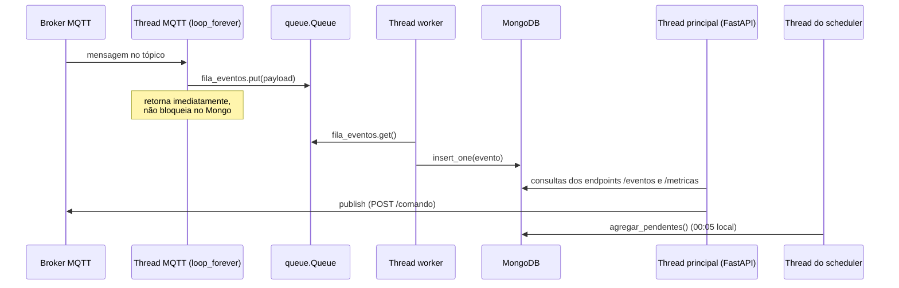

# Arquitetura

Este documento descreve a arquitetura do projeto em duas camadas: primeiro a **visão geral do
sistema completo** (os quatro protótipos propostos em [`1_PLANEJAMENTO.pdf`](./1_PLANEJAMENTO.pdf)),
depois o **detalhamento da API** (o backend em Python, que implementa o Protótipo 3 e é o que
existe hoje neste repositório).

Os relatórios de execução dos Protótipos 1 e 2 (montagem física, código MicroPython, testes com
o broker público) estão em [`2_RELATÓRIO_PROTO2.pdf`](./2_RELATÓRIO_PROTO2.pdf).

## Índice

1. [Visão geral do sistema](#1-visão-geral-do-sistema)
2. [Arquitetura da API](#2-arquitetura-da-api)
3. [Limitações conhecidas e próximos passos](#3-limitações-conhecidas-e-próximos-passos)

## 1. Visão geral do sistema

### 1.1. Motivação e objetivo

O sistema detecta presença e luminosidade ambiente para controlar uma carga de iluminação de
forma autônoma, evitando desperdício de energia com luzes acesas em ambientes vazios ou já
iluminados naturalmente. A arquitetura é distribuída em quatro protótipos incrementais, cada um
funcional de forma independente:

| Protótipo | Escopo | Status |
|---|---|---|
| 1 - Detecção e controle local | ESP32 + HC-SR04 + LDR, fusão de contexto, aciona o LED localmente | ✅ implementado |
| 2 - Conectividade e publicação MQTT | ESP32 publica eventos de transição de estado (JSON) num broker público (HiveMQ) | ✅ implementado |
| 3 - Gateway computacional e persistência | Backend Python assina o tópico MQTT, persiste eventos e calcula eficiência energética | ✅ implementado (**este repositório**) |
| 4 - Interface e atuação remota bidirecional | Frontend React consome a API e publica comandos de controle manual num tópico MQTT; ESP32 assina esse tópico e aceita override temporário | ✅ implementado; backend e firmware validados no hardware e frontend validado por build/lint (ver [`VALIDACAO.md`](./VALIDACAO.md)) |

### 1.2. Diagrama de blocos



As três setas fora dos subgraphs formam o canal de controle remoto, que só existe a partir do
Protótipo 4 — antes dele o ESP32 apenas publicava, sem assinar nada. Um comando chega ao tópico de
controle por **dois caminhos equivalentes**: o navegador publicando direto por WebSocket, e
`POST /comando` publicando pelo backend (ver 2.6 quanto ao motivo de existirem os dois). A seta de
`Broker` para `ESP` fecha o circuito: é o ESP32 assinando o tópico de comando, além de continuar
publicando no de eventos.

### 1.3. Papel de cada componente

- **ESP32 (Protótipos 1, 2 e 4):** lê os sensores, decide o estado do LED e publica um evento sempre
  que essa decisão muda (não faz polling contínuo — só transições). A partir do Protótipo 4 também
  assina o tópico de controle e aceita override manual, e a condição de publicação passa a ser a
  mudança do par **(estado, origem)**, não só do estado. Isso importa porque um comando manual pedindo
  o estado em que o LED já está não altera `led`, mas altera quem está decidindo — sem publicar esse
  evento, o backend não teria como saber que um override começou, e `agregar_dia()` não teria o marco
  para parar de contar aquele intervalo como economia autônoma.
- **Broker MQTT:** desacopla publishers e subscribers. Hoje é o broker público `broker.hivemq.com`;
  nada na arquitetura impede trocar por um broker privado (só requer credenciais e TLS, já
  suportado em `mqtt_client.py`).
- **Backend / API (Protótipo 3):** um único processo Python com três responsabilidades — assinar o
  tópico MQTT, persistir os eventos brutos e as métricas agregadas, e expor tudo via REST. Detalhado
  na seção 2.
- **Frontend (Protótipo 4, futuro):** consumirá os endpoints REST para exibir histórico e métricas, e
  publicará no tópico de controle para sobrepor manualmente a lógica autônoma do ESP32.

## 2. Arquitetura da API

### 2.1. Stack e decisões de framework

FastAPI foi escolhido em vez de Flask por três motivos práticos, todos relevantes para este projeto
especificamente:

- validação automática de request/response com Pydantic;
- documentação Swagger gerada automaticamente em `/docs`, útil já que o Protótipo 4 vai consumir
  esses mesmos endpoints;
- suporte nativo a `async`, relevante porque o subscriber MQTT e a API rodam no mesmo processo
  (ver 2.3).

### 2.2. Estrutura de pastas

```
backend/
├── main.py           # instância do FastAPI, lifespan, registro dos routers
├── config.py         # load_dotenv e todas as constantes (Mongo, MQTT)
├── database.py       # conexão com Mongo, inicializar_banco() (índices)
├── mqtt_client.py    # subscriber paho-mqtt, fila de eventos, worker de inserção
├── services.py       # regras de negócio de cálculo (agregar_dia())
├── routers/
│   ├── comando.py    # endpoint /comando (atuação remota via MQTT)
│   ├── estado.py     # endpoint /estado (estado corrente + modo de operação)
│   ├── eventos.py    # endpoints /eventos e /eventos/hoje
│   └── metricas.py   # endpoints /metricas e /metricas/agregar
├── .env              # não versionado — ver variáveis na seção 2.7
└── requirements.txt
```

Cada módulo importa apenas de quem está "acima" dele nessa lista (`config.py` não importa nada
interno; `database.py` só importa de `config.py`; `mqtt_client.py` e `services.py` importam de
`database.py`; os `routers/` importam de `database.py` e `services.py`; `main.py` importa de todos).
Isso evita import circular e deixa explícito onde cada responsabilidade mora.

### 2.3. Modelo de concorrência: três threads

O subscriber MQTT (`paho-mqtt`) e a API (FastAPI/uvicorn) rodam no mesmo processo. A alternativa
seria dois processos separados, mas isso duplicaria a conexão com o Mongo e exigiria um mecanismo
extra de comunicação entre eles — desnecessário aqui, já que os dois lados só precisam compartilhar
o banco de dados.



Quatro threads rodam simultaneamente, todas iniciadas no `lifespan` de `main.py`:

1. **Thread principal** — o processo do uvicorn/FastAPI, atende requisições HTTP.
2. **Thread do subscriber** (`iniciar_subscriber`, daemon) — roda `client.loop_forever()`, bloqueada
   esperando mensagens do broker.
3. **Thread do worker** (`worker_insercao`, daemon) — consome `fila_eventos` e insere no Mongo.
4. **Thread do scheduler** — criada pelo `BackgroundScheduler` do APScheduler, dispara
   `agregar_pendentes()` às 00:05 locais (ver 2.5). É justamente por rodar em thread própria que ela
   não bloqueia o event loop do FastAPI.

A thread principal também **publica** comandos, quando `POST /comando` é chamado: ela usa o mesmo
cliente paho da thread 2 (ver "`POST /comando` e o cliente MQTT compartilhado" na seção 2.6). Isso é
seguro porque `publish()` do paho é thread-safe enquanto o loop de rede está rodando.

A `queue.Queue` é o único ponto de comunicação entre as threads 2 e 3, e é thread-safe por
construção do próprio módulo `queue`. Ela existe para que uma escrita lenta no Mongo nunca atrase o
recebimento de mensagens MQTT — se o worker atrasar, mensagens só se acumulam na fila em memória,
o `on_message` do paho continua respondendo rápido.

### 2.4. Fluxo de dados: do ESP32 ao MongoDB

```
paho-mqtt recebe mensagem → json.loads() → deposita na fila →
worker consome a fila → anexa timestamp (UTC) → insere no MongoDB
```

O ESP32 já publica o payload como JSON (`ujson.dumps()`, ver Protótipo 2). O backend decodifica com
`json.loads()` e o timestamp é sempre gerado no backend (`datetime.now(timezone.utc)`), nunca lido
do payload do ESP32 — o microcontrolador não tem RTC confiável sem sincronização NTP, então anexar
o timestamp no momento da recepção é a fonte de verdade correta para um log de eventos.

### 2.5. Modelo de dados e persistência (MongoDB)

Duas coleções, com políticas de retenção deliberadamente diferentes:

#### `eventos` — retenção curta (dados brutos)

```jsonc
{ "led": "on" | "off", "distancia": 12.4, "luminosidade": 812,
  "origem": "sensor" | "manual", "timestamp": ISODate }
```

`origem` distingue a transição decidida pela fusão de contexto do ESP32 (`"sensor"`) da provocada por
comando manual do dashboard (`"manual"`). Documentos gravados antes desse campo existir não o têm, e
todo o código que o lê usa `.get("origem", "sensor")` — tratar a ausência como `"sensor"` é o que
mantém as métricas do histórico corretas, já que até então só havia controle autônomo.

Cada documento é uma transição bruta do par (estado, origem) — ver 1.3 quanto a por que a origem
também dispara publicação. A coleção tem um **TTL index** em `timestamp`
(`expireAfterSeconds=604800`, 7 dias) — o MongoDB apaga os documentos automaticamente, sem
precisar de nenhum job de limpeza. Sete dias é suficiente para a visualização de histórico recente no
frontend e para o cálculo de métricas do período corrente; guardar o evento bruto indefinidamente
não teria uso e faria a coleção crescer sem limite.

#### `metricas` — retenção longa (dados agregados)

```jsonc
{ "data": ISODate, "total_eventos": 14, "tempo_apagado_s": 61200.0, "percentual_economia": 70.83 }
```

Um documento por dia, com índice único em `data`, que guarda a **meia-noite local** do dia agregado
(para `America/Sao_Paulo`, o instante `03:00Z`) — permite `upsert` idempotente. Ao contrário dos
eventos brutos, esse documento é pequeno e não cresce com o volume de eventos — faz sentido
guardá-lo indefinidamente, é o dado que efetivamente importa para o relatório final (quanto tempo a
iluminação ficou desligada de forma autônoma, e o percentual de economia correspondente).

A função `agregar_dia()` em `services.py` é quem calcula e persiste esse documento: busca os
eventos do dia, mais o último evento *anterior* ao dia (para saber o estado do LED exatamente à
meia-noite), e percorre a linha do tempo somando os intervalos em que o LED esteve "off" — incluindo
o intervalo antes do primeiro evento e depois do último, não só entre eventos consecutivos.

Ao percorrer a linha do tempo ela rastreia **estado e origem juntos**, e só soma o intervalo quando o
LED está `off` *e* a origem daquele estado é `sensor` — tempo apagado por comando manual não é
economia autônoma. Vale registrar por que o atalho óbvio não serve: filtrar os eventos `manual` fora
da query corromperia a linha do tempo. Se o usuário acende o LED manualmente às 11h num período em
que os sensores o mantinham apagado, descartar esse evento faria o cálculo enxergar o LED apagado das
10h às 12h e **superestimar** a economia. É preciso ler todos os eventos para conhecer o estado real
e usar a origem apenas como critério de contagem.

#### Política de fuso horário: instantes em UTC, fronteiras de dia em local

Duas coisas diferentes são tratadas de formas diferentes de propósito:

- **Instantes** — o `timestamp` de cada evento e a comparação de expiração do override em
  `estado_corrente()` — ficam sempre em **UTC**. É o correto para representar "quando algo aconteceu",
  e a comparação entre datetimes aware é feita por instante, então o fuso não afeta o resultado.
- **Fronteiras de dia** — a que dia um evento pertence, nas agregações e em `GET /eventos/hoje` — usam
  `TZ_LOCAL` (`America/Sao_Paulo` por padrão).

A fronteira precisa ser local porque padrões de ocupação seguem o horário local: as pessoas saem da
sala às 18h de Brasília, não às 18h UTC. Com fronteira em UTC, um evento das 22h de Brasília cairia no
**dia seguinte** da métrica, e "economia diária" passaria a medir um dia deslocado em três horas.

Três detalhes da implementação:

- **`ZoneInfo`, não offset fixo `-3`.** O Brasil aboliu o horário de verão em 2019, mas se voltar, um
  offset fixo erraria em silêncio metade do ano. `zoneinfo` é stdlib (3.9+), então não há dependência
  nova — mas em **Windows nativo** ele não encontra o banco de fusos do sistema e exige
  `pip install tzdata`; em Linux/container funciona direto.
- **`agregar_dia(data)` interpreta a data civil**, não o instante. Ela usa ano/mês/dia do datetime
  recebido e ignora o fuso dele. Se convertesse o instante para local, meia-noite UTC do dia 20 viraria
  21h do dia 19 e a função agregaria o dia errado.
- **A duração do dia é calculada, não fixada em `86400`.** `percentual_economia` divide pelo intervalo
  real entre as duas meia-noites locais. Hoje isso sempre dá 86400, mas se o horário de verão voltar,
  um dia de 23h ou 25h passaria a produzir percentual errado sem nenhum sinal.
- **As duas meia-noites são convertidas para UTC antes de qualquer aritmética.** Não é cosmético: no
  Python, quando os dois operandos de uma subtração compartilham o **mesmo objeto** `tzinfo` — e o
  `ZoneInfo` é cacheado, portanto compartilham — a subtração é feita sobre os valores ingênuos e os
  offsets são ignorados. Sem a conversão, um dia de 25h daria 24h, anulando justamente o item acima.
  Em UTC todos os offsets são zero e a aritmética passa a ser correta, inclusive contra os timestamps
  dos eventos, que também são UTC. Coberto pelos testes de horário de verão em
  `backend/tests/test_metricas.py`.

##### Migração ao adotar a fronteira local

Documentos de `metricas` gravados antes dessa mudança têm `data` em meia-noite **UTC** (`00:00Z`),
enquanto os novos usam meia-noite local (`03:00Z`). Como `agregar_pendentes()` verifica a existência
da métrica comparando esses valores, os antigos nunca casam: todo dia parece pendente, e o resultado
são **dois documentos para o mesmo dia civil**, um em cada convenção. O índice único em `data` não
impede isso, porque `00:00Z` e `03:00Z` são de fato valores distintos.

A migração é um passo único e manual: **esvaziar a coleção `metricas`** (nunca `eventos` — são a
matéria-prima da reconstrução) e deixar `agregar_pendentes()` reconstruir tudo no próximo startup, a
partir dos eventos ainda dentro da janela do TTL.

O job de agregação depende de rodar **antes** que o TTL de 7 dias apague os eventos brutos do dia
que ele precisa agregar. Quem cuida disso é `agregar_pendentes()`, também em `services.py`: ela
varre dia a dia, do primeiro evento ainda em base até ontem, e chama `agregar_dia()` para cada dia
que ainda não tem métrica.

Essa função é chamada em dois momentos, no `lifespan` de `main.py`:

1. **No startup**, de forma síncrona, antes de aceitar requisições.
2. **Todo dia às 00:05 UTC**, por um `BackgroundScheduler` do APScheduler com `CronTrigger`.

A redundância é deliberada, e o motivo é o padrão de uso real do projeto: a API não fica de pé 24
horas — sobe quando alguém está trabalhando nela e desce depois. Um scheduler sozinho quase nunca
encontraria o processo rodando às 00:05, e a coleção `metricas` acumularia buracos. A varredura no
startup é o que efetivamente fecha esses buracos, enquanto o job diário cobre o caso de a API
atravessar a virada do dia de pé.

Três decisões valem registro:

- **APScheduler no processo, não cron do sistema.** Mantém a mesma escolha da seção 2.3 (tudo num
  processo único com threads daemon) — um cron de SO exigiria um entrypoint separado, uma segunda
  conexão com o Mongo e configuração fora do código. O scheduler roda em thread própria, então não
  bloqueia o event loop do FastAPI.
- **Varredura dia a dia, não "dias que têm evento".** Seria mais direto perguntar ao Mongo quais
  dias têm eventos e agregar os que não têm métrica, mas isso perderia um caso legítimo: um dia sem
  nenhuma transição (LED no mesmo estado da meia-noite à meia-noite) merece métrica igual — e
  `agregar_dia()` sabe calculá-la a partir do último evento anterior ao dia. O intervalo varrido é
  curto por construção, já que o TTL mantém no máximo ~7 dias de eventos.
- **O dia corrente fica de fora.** A varredura só considera dias já encerrados (`dia < hoje`). Se
  gravasse métrica para o dia em andamento, ela seria parcial e nunca mais recalculada — o dia
  deixaria de constar como pendente nas execuções seguintes, congelando o valor incompleto.

Sobre o `misfire_grace_time=3600` do job: o default do APScheduler é 1 segundo, o que significa que
um atraso trivial (máquina sob carga, processo suspenso, container throttled) faz o disparo ser
descartado silenciosamente. Uma hora absorve atrasos transitórios; atrasos maiores que isso são
cobertos pela varredura de pendentes na próxima subida da API.

O `POST /metricas/agregar` continua existindo como gatilho manual (e é o que os testes usam).

### 2.6. Endpoints

| Método | Rota | Descrição |
|---|---|---|
| `POST` | `/comando` | Publica um comando manual (`{"led": "on" \| "off"}`) no tópico de controle. Confirma a publicação no broker, não a atuação — ver abaixo. |
| `GET` | `/estado` | Estado corrente do sistema: último estado do LED, leituras de sensor, `origem` da transição e `modo` de operação (`automatico` \| `manual`). Alimenta o cartão de estado e o indicador de modo no frontend. |
| `GET` | `/eventos?limite=50` | Eventos brutos mais recentes, ordem decrescente. Alimenta a visualização de histórico. |
| `GET` | `/eventos/hoje` | Todos os eventos brutos do dia corrente (UTC), ordem crescente. |
| `GET` | `/metricas?limite=30` | Métricas diárias agregadas mais recentes, ordem decrescente. Alimenta o painel de eficiência energética. |
| `POST` | `/metricas/agregar` | Dispara `agregar_dia()` para o dia anterior. Durante os testes substitui o job automático de produção. |

#### `POST /comando` e o cliente MQTT compartilhado

Este endpoint existe para que o backend medie os **dois** sentidos da comunicação, e não só a
ingestão — é o que torna o "gateway computacional" um gateway de fato. Ele não substitui o caminho do
frontend, que publica no mesmo tópico direto por WebSocket: os dois convergem no mesmo lugar, e o
endpoint é aditivo. Ganhos concretos de tê-lo:

- o Swagger em `/docs` passa a servir como painel de controle manual, sem depender do frontend rodando
  nem de o browser alcançar o broker por WebSocket;
- a configuração do broker deixa de existir só no frontend para esse caminho.

Uma consequência de implementação: o cliente paho **deixou de ser local** à thread do subscriber e
passou a ser singleton de escopo de módulo em `mqtt_client.py`, porque o handler HTTP publica por ele.
Não é preciso abrir uma segunda conexão — `publish()` do paho é thread-safe enquanto o loop de rede
roda em outra thread, então a mesma conexão serve para publicar comandos (thread HTTP) e receber
eventos (thread do subscriber).

A resposta do endpoint confirma que o comando foi entregue ao broker, **não** que o ESP32 recebeu ou
atuou — a placa pode estar desligada ou sem Wi-Fi. A confirmação real de atuação é o evento com
`origem: "manual"` que o ESP32 publica de volta, observável em `GET /eventos` e `GET /estado`.

#### Por que `GET /estado` existe

O `modo` de operação não é campo de nenhum documento do banco: ele é derivado. No caminho felizemente
comum, o próprio firmware avisa — ele publica um evento quando a *origem* da decisão muda, inclusive
na volta de `manual` para `sensor` ao fim do override (ver 1.3), então o último evento persistido já
reflete quem está decidindo.

O problema é o caminho de falha. Se o ESP32 perder o Wi-Fi, travar ou ser desligado durante o
override, esse evento de volta nunca chega, e o último evento no banco continua sendo o
`origem: "manual"` indefinidamente — um cliente que olhasse só `GET /eventos` concluiria que o
sistema está em override para sempre.

Por isso `estado_corrente()` em `services.py` não confia apenas no último evento: soma
`OVERRIDE_MANUAL_SEGUNDOS` ao timestamp do evento manual e compara com o instante atual, expirando o
override por conta própria se a janela já fechou. É uma rede de segurança, não o mecanismo primário.
Consequência: essa constante em `config.py` **precisa** ter o mesmo valor do firmware — são dois
relógios medindo a mesma janela.

Documentação interativa (Swagger) em `http://localhost:8000/docs` com o servidor rodando.

### 2.7. Configuração (`.env`)

| Variável | Obrigatória | Default | Descrição |
|---|---|---|---|
| `MONGO_URI` | sim | — | Connection string do MongoDB (Atlas free tier serve bem). |
| `MQTT_BROKER` | não | `broker.hivemq.com` | Host do broker MQTT. |
| `MQTT_PORTA` | não | `1883` | Porta do broker. Brokers privados com TLS tipicamente usam `8883`. |
| `MQTT_TOPICO` | não | `pervasiva/grupo1/iluminacao` | Tópico assinado pelo subscriber. |
| `MQTT_TOPICO_CONTROLE` | não | `pervasiva/grupo1/iluminacao/controle` | Tópico onde `POST /comando` publica. O ESP32 assina este tópico, e o frontend publica nele direto por WebSocket. |
| `MQTT_USER` / `MQTT_PASSWORD` | não | `None` | Só configuradas se o broker exigir autenticação — quando presentes, o client também habilita TLS (`tls_set()`). |
| `OVERRIDE_MANUAL_SEGUNDOS` | não | `300` | Duração do override manual (5 minutos). Precisa ser igual ao valor no firmware do ESP32 — ver "Por que `GET /estado` existe" na seção 2.6. |
| `TZ_LOCAL` | não | `America/Sao_Paulo` | Fuso usado para as fronteiras de dia nas agregações e em `GET /eventos/hoje`. Não afeta os timestamps gravados, que seguem em UTC — ver "Política de fuso horário" na seção 2.5. |

No MongoDB Atlas é preciso liberar o IP de acesso; em desenvolvimento, `0.0.0.0/0` evita travar
durante os testes (não recomendado para produção).

## 3. Limitações conhecidas e próximos passos

- **Distinção entre "off" autônomo e manual:** `percentual_economia` hoje assume que todo intervalo
  "off" é economia autônoma — válido porque, até o Protótipo 3, o LED só é controlado pela lógica de
  sensores do ESP32. A partir do Protótipo 4, com controle manual via MQTT, essa suposição deixa de
  valer e o cálculo de eficiência energética vai precisar diferenciar as duas origens (provavelmente
  adicionando um campo de origem no evento, ex. `"origem": "sensor" | "manual"`).
- **Janela de recuperação limitada pelo TTL:** `agregar_pendentes()` (seção 2.5) recupera qualquer
  dia sem métrica na próxima vez que a API subir, o que cobre o cenário realista de a máquina passar
  alguns dias desligada. Mas a recuperação só é possível enquanto os eventos brutos existirem: se a
  API ficar mais de 7 dias sem subir, o TTL apaga os eventos daqueles dias e as métricas
  correspondentes tornam-se impossíveis de calcular, de forma definitiva. Isso é inerente à escolha
  de retenção curta para dados brutos — a única mitigação real seria aumentar o
  `expireAfterSeconds`, trocando espaço em banco por uma janela de recuperação maior.
- **Dia sem eventos é ambíguo:** como o ESP32 só publica em transição de estado (seção 1.3), um dia
  sem nenhum evento pode significar duas coisas opostas — o dispositivo estava ligado e o LED
  permaneceu estável (economia real), ou o dispositivo estava desligado (nada aconteceu). A coleção
  `eventos` não distingue os dois casos, e `agregar_dia()` assume o primeiro: herda o estado do
  último evento anterior, o que tipicamente resulta em `percentual_economia: 100.0` para dias em que
  o ESP32 estava simplesmente fora do ar. Esses dias são identificáveis por `total_eventos: 0` na
  métrica. A correção adequada seria um heartbeat periódico do ESP32 (publicando liveness mesmo sem
  transição), permitindo diferenciar "ocioso" de "offline" — fora do escopo da proposta atual.
